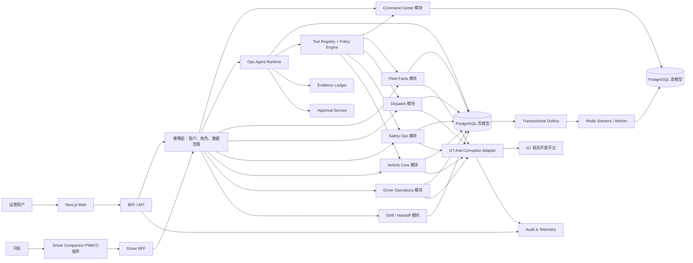

# 车队作战台架构主干

## 1. 架构结论

V1 采用 **TypeScript 模块化单体 + PostgreSQL + 事务 Outbox + Redis Streams 兼容事件通道**。Web 与 API 在同一代码库独立部署，G7 易流通过服务端反腐层接入。领域写模型保持简单一致，今日工作流、对象搜索和上下文时间线使用事件投影形成读模型。

不在 V1 拆分微服务。理由：业务边界仍需通过首批客户验证；派车、风险和车务共享对象上下文、权限与审计；过早分布式化会把 G7 外部一致性与本地一致性同时复杂化。模块必须通过应用端口交互，为未来按负载/团队拆分保留边界。

## 2. 系统边界与真相所有权

| 数据/行为 | 真相所有者 | 本地策略 |
|---|---|---|
| 车辆、司机、地址、设备主数据 | G7 或客户上游 | 保存标准化镜像、映射、版本与最后同步时间 |
| 位置、速度、车况、事件、围栏进出 | G7 | 只追加原始事实/摘要，不允许业务用户改写 |
| 人车绑定事实 | G7 | 本地先校验并记录同步命令，G7 确认后形成事实 |
| 派车任务与生命周期 | Fleet Office | 本地强一致；外部绑定状态单独记录 |
| 风险分级、接手、干预、复核 | Fleet Office | 本地强一致，保留来源事件引用 |
| 证照原始记录 | G7/客户文档 | 本地关联任务与版本，不覆盖来源值 |
| 维护计划与结果 | Fleet Office | 本地拥有，可引用 G7 里程/车况事实 |
| 权限、审计、配额 | Fleet Office | 所有请求的统一策略入口 |

## 3. 逻辑架构

完整系统由五个正交平面组成：运营事实平面拥有订单、履约、运力、安全、车务、客户与结算；Agent 能力平面负责目标、上下文、计划、工具、审批、handoff、回读和评估；知识平面管理 SOP/合同/SLA 的版本与引用；控制平面实施租户、权限、预算和工具政策；数据与观测平面负责事件、读模型、血缘、指标和 trace。各平面可以同仓部署，但依赖方向必须保持单向。



### 请求路径

1. Web 只调用本产品 BFF，携带本产品会话与 `request_id`。
2. 策略层解析 `tenant_id`、角色、组织/标签数据范围，并将作用域对象传给应用服务。
3. 查询优先命中本地读模型；明确的“刷新事实”才触发受限的 G7 按需调用。
4. 写操作在本地事务中更新聚合并写 Outbox；异步 Worker 投影读模型或执行 G7 命令。
5. 所有外部调用记录发生/接收时间、尝试次数、错误映射和 trace 关联。
6. Agent Runtime 先创建运行计划和作用域，再从 Tool Registry 调用读/草稿/写/敏感工具；任何写工具由 Policy Engine 判断风险并在需要时创建 ApprovalRequest。
7. 外部写工具执行后必须通过 Verification Worker 回读本地聚合和 G7 事实，只有回读结果才能将运行标记为完成。
8. Driver Companion 只调用 Driver BFF；设备会话绑定有效司机/任务，离线命令先写本机加密队列，服务端按幂等键、任务版本和时效重放。
9. 角色工作空间配置由服务端按 UserRole、DutyShift、Delegation 和数据范围返回；前端隐藏入口不构成授权。

## 4. 技术基线

版本于 2026-08-20 对照官方文档确认；创建代码库时应锁定精确 patch 并生成 lockfile。

| 层 | 选择 | 版本/依据 | 说明 |
|---|---|---|---|
| Runtime | Node.js | 24 LTS | 生产使用 LTS；[Node.js Releases](https://nodejs.org/en/about/previous-releases) |
| Web/BFF | Next.js App Router | 16.x | 服务端组件、路由与 BFF 同仓；[Next.js 安装文档](https://nextjs.org/docs/app/getting-started/installation) |
| 语言 | TypeScript | 5.x strict | 跨 Web、应用端口和适配器共享类型 |
| 主库 | PostgreSQL | 18.x | RLS 辅助租户隔离、JSONB 承载来源扩展；[PostgreSQL 当前文档](https://www.postgresql.org/docs/current/) |
| 事件通道 | Redis Streams | 8.x compatible | Consumer Group、ack、回放和保留；[Redis Streams](https://redis.io/docs/latest/develop/use-cases/streaming/) |
| E2E | Playwright | 当前稳定版 | Chrome/Edge 关键旅程；[Playwright 文档](https://playwright.dev/docs/intro) |
| 遥测 | OpenTelemetry JS | 当前稳定 API | Trace/Metrics；日志使用结构化记录；[OpenTelemetry JS](https://opentelemetry.io/docs/languages/js/) |

组件库在实现阶段选择现有成熟无障碍 primitives；视觉 token 以 `DESIGN.md` 为唯一来源，不把组件库默认主题当作产品设计。

## 5. 架构决策

### AD-001 G7 反腐层是唯一外部入口

`integrations/g7` 负责签名、必需头、版本、时区、脱敏、错误码、分页/游标和模型转换。领域模块不得直接导入 G7 SDK/HTTP 客户端。浏览器永不持有 access key、签名材料或 G7 租户代码。

### AD-002 Snapshot / Feed / History 分工

- Snapshot：当前对象上下文和候选比较；允许短 TTL 缓存。
- Feed：驱动事件/状态变化，游标按 `tenant + feed_type + partition` 持久化。
- History：仅用户按需或后台核对时查询，强制最大时间窗、分页和配额。
- Webhook/Stream：待 G7 合同和租户能力确认后适配到同一 ingestion port。

禁止用高频全量 Search 轮询模拟 Feed。

### AD-003 业务状态与同步状态正交

`Dispatch.status=CONFIRMED` 与 `G7Sync.status=FAILED` 可以同时存在。外部失败不回滚用户已经确认的本地业务动作；UI 显示“已派/待同步”，用户可重试或撤销。

### AD-004 租户与数据范围是查询构造的一部分

每张业务表含 `tenant_id`；所有仓储接口要求 `TenantScope`。组织与标签范围先在本地策略层求交/并（最终规则待 OQ-008），再映射 G7 data scope。PostgreSQL RLS 作为纵深防御，不替代应用层授权。

### AD-005 外部事实不可变、本地派生可重算

原始 G7 事实以 `source_event_id/source_cursor/happened_at/received_at/payload_hash` 标识；重复输入不新增事实。风险等级、延误判断和工作流项是带 `rule_version` 的派生结果，可重算并保留修订。

### AD-006 幂等命令与冲突保护

所有写命令接受 `idempotency_key`。唯一约束至少覆盖：

- `(tenant_id, command_type, idempotency_key)`
- `(tenant_id, source_system, external_id)`
- `(tenant_id, source_system, source_event_id, payload_hash)`

人车时间冲突在本地事务内查询并加顾问锁/排它策略，仍以 G7 返回冲突为最终外部确认。

### AD-007 Outbox 驱动投影与外部同步

领域事务同时写业务表和 `outbox_event`。Publisher 将事件投递到 Streams；Consumer 采用至少一次语义，按 event ID 去重。消费失败进入有界重试，随后写 Dead Letter 并生成管理员工作项。

### AD-008 审计是写入合同的一部分

应用服务写入业务聚合时同步记录 `audit_event`：actor、role、tenant、object、before/after 摘要、reason、request/trace ID、source app、IP/device metadata。敏感字段存哈希或脱敏值，不在审计里复制凭据/媒体。

### AD-009 降级优先保住办公闭环

G7 读失败：展示最后成功事实和新鲜度；本地任务读写可继续。G7 写失败：保留待同步命令并指数退避，达到上限后人工处理。游标失效：暂停对应分区、记录缺口窗口、用 Historical 接口回补后恢复 Feed。

### AD-010 成熟度门禁

只有 G7 `released` 接口可成为 V1 验收硬依赖。`/trips/_search` 当前 `developing`，封装在 `trip-segment-search` 特性开关后，关闭时在途时间线由派车计划、位置历史和围栏记录组成。

### AD-011 命令入口不绕过应用服务

命令面板只解析意图并预填结构化命令；所有写操作仍进入同一权限、校验、幂等和审计管道。系统建议不能直接调用 G7 写接口。

### AD-012 先模块化单体，按证据拆分

未来拆分触发条件：某模块独立扩缩容/合规隔离需求持续存在、团队所有权稳定、事件合同已验证。首选可拆模块是 G7 ingestion worker 与媒体代理，不按 CRUD 实体拆服务。

### AD-013 Agent Runtime 是产品编排层，不是真相层

`ops-agent` 负责 Thread/Turn 生命周期、计划、上下文选择、工具编排、运行事件、恢复和交接；它不拥有车辆、位置、派车或安全事件事实。Agent 输出只能落到结构化提案、草稿和审计事件，不能直接改写 `G7Fact`。

### AD-014 Tool Registry 是唯一模型工具入口

工具注册包含 `tool_id`、版本、输入/输出 schema、读写类型、数据范围、风险等级、幂等键、超时、可撤销性、审批要求和审计字段。Agent 只获得当前 Thread 允许的工具目录；G7 凭据和签名永远留在 `integrations/g7`。

### AD-015 Context Pack 版本化并作用域化

租户政策、车队 SOP、路线/时窗、司机安全、客户 SLA 和监管规则以 `ContextPack` 存储，拥有版本、优先级、适用组织/标签、有效期和来源。运行开始时生成不可变快照；策略冲突或过期会阻止写工具。

### AD-016 证据账本与模型结论分离

`EvidenceClaim` 只引用不可变 G7Fact/业务记录，记录来源、时间、接收时间、新鲜度、请求/trace ID 和权限；`AgentFinding` 记录事实、推断、未知、冲突和置信度。UI 可以展示短依据，但不保存或展示隐藏思维链。

### AD-017 风险审批是独立策略服务

`R0` 只读、`R1` 本地草稿、`R2` 外部副作用、`R3` 安全/敏感动作由 Policy Engine 判定。ApprovalRequest 绑定 Thread、ToolCall、参数摘要、证据快照、策略版本、批准人和过期时间；R3 需要不同主体双人复核。

### AD-018 写后回读是完成态门禁

ToolCall 的 `succeeded` 只代表上游接受请求。Verification Worker 必须重新读取本地业务状态和 G7 对应事实，生成 `VerificationResult`：`EFFECTIVE`、`PENDING_SYNC`、`READBACK_DELAYED` 或 `FAILED`。运行只有 `EFFECTIVE` 或明确人工接管后才可关闭。

### AD-019 并行专家返回结构化结果

Agent Runtime 可为同一 Thread 启动证据、ETA/方案、风险合规和动作草拟专家；每个专家只能使用分配的作用域和工具，返回 schema 化 findings/evidence/recommendations。主运行合并一致/冲突/未知并控制 token、工具和媒体预算。

### AD-020 线程事件追加写入并可恢复

`AgentThread`、`AgentTurn`、`RunEvent` 和 `ToolCall` 以追加事件保存，摘要只作为可重建投影。浏览器断开、上下文压缩或班次交接时保留作用域、关键事实、未解决问题、审批状态、最后同步时间和审计链接。

### AD-021 Agent 运行必须可评估

黄金案例以固定输入、作用域、工具夹具和期望结果回放；评估保存证据覆盖率、动作正确性、审批绕过、回读一致性、人工接管和 token/工具成本。模型版本或策略版本变化必须重新跑关键案例。

### AD-022 订单履约是独立聚合，不复用派车任务

`Order` 保存客户承诺，`Shipment/Leg` 保存运输结构，`DispatchWork` 保存执行分配。三者通过显式 ID 关联和领域事件同步状态，避免订单变更直接篡改已确认派车，也允许一单多段、多单合运和补运。

### AD-023 影响图是事件投影，不是图数据库真相

异常影响图从订单、运输段、停靠点、派车、车辆、司机、客户和后续任务事件投影；V1 使用 PostgreSQL 邻接表/物化读模型。只有查询深度、规模和独立扩缩容证据出现后才评估图数据库。

### AD-024 计划场景与生产计划隔离

What-if 使用版本化 `PlanningScenario` 和输入快照，不能直接更新 `DispatchWork`。只有用户选择“生成草稿”才通过应用服务创建新派车命令；场景保存指标口径、约束版本和差异。

### AD-025 沟通通过 Channel Adapter 统一发送

邮件、短信、企业消息和承运商渠道由 `collaboration` 模块的 Channel Port 适配。Agent 只生成结构化 `CommunicationDraft`；收件人、敏感字段、渠道权限和 R2 批准由服务端检查，发送回执进入统一时间线。

### AD-026 结算采用证据匹配层

合同费率、履约事实、费用凭证和外部账单保持来源不可变；`ReconciliationCase` 记录匹配、差异、调整提案和批准。Fleet Office 不替代财务总账，也不静默回写原账。

### AD-027 Playbook 编排复用 Tool Registry

自动化步骤只能引用注册工具、条件和审批策略；Playbook 有不可变版本、试运行、发布范围和回滚指针。每次运行仍创建 Agent/Automation RunEvent，因此人工触发、定时触发和事件触发共享审计与回读合同。

### AD-028 知识检索先权限过滤再向量检索

KnowledgeItem 分段前固化租户、组织、标签、生效期和来源位置；查询先求权限/有效期候选集合，再执行全文或向量检索。引用保存内容版本与片段定位，删除/失效能够反向找到受影响的 Agent 和 Playbook。

### AD-029 多 Agent 默认使用 Manager 模式

跨域任务默认由主 Agent 保持用户控制、最终答案和统一 guardrail，把领域 Agent 作为工具调用；只有用户需要直接与专业角色继续工作时才 handoff。会话状态、handoff 输入过滤和工具权限必须在服务端持久化。

### AD-030 模型运行与业务持久化分离

模型供应商的会话/后台运行状态不能成为唯一业务状态。Thread、Run、Approval 和 Verification 始终落入本地存储；是否使用供应商托管会话、后台模式或远程 MCP 由租户数据策略决定，并记录保留边界。

### AD-031 指标语义层版本化

经营指标和预测输入通过 `MetricDefinition`、`DatasetSnapshot` 和 `ModelRun` 保存口径、版本、过滤、血缘和结果。自然语言分析只能查询已授权语义层，不能生成绕过口径的临时 SQL 作为正式 KPI。

### AD-032 角色工作空间配置由服务端生成

`RoleWorkspaceProfile` 是版本化配置，包含默认首页、导航顺序、字段投影、通知与 AI 模式，但不直接授予权限。BFF 基于用户角色、DutyShift、Delegation 与 TenantScope 求交后返回；切换角色写入审计并重新签发短期作用域声明。

### AD-033 Driver Companion 使用独立 BFF 和命令面

司机端不复用内部 Web BFF。Driver BFF 只暴露当前有效任务、站点、允许动作、消息和凭证端点，按司机、设备会话、任务与时间窗做最小授权；服务端不向司机端返回内部经营、其他司机、Agent 工具或 G7 凭据。

### AD-034 离线命令使用设备账本和幂等对账

Driver Companion 以 `device_id + local_command_id` 生成稳定幂等键，本地加密保存最小命令与附件引用。服务端 `DriverCommandLedger` 保存接收、冲突、拒绝、过期和结果；补传不得覆盖 G7 事实，来源冲突生成运营复核工作。

### AD-035 调度资源采用短租约和乐观并发

`DispatchReservation` 对车辆、司机与时间窗建立短期租约，包含所有者、版本、TTL 与计划快照。批量发布逐项使用期望版本，成功项提交后不可因同批失败回滚；过期/冲突项返回当前所有者和可恢复草稿。

### AD-036 业务交接是独立聚合

`Handoff` 持有交出/接收主体、DutyShift、对象引用、已确认事实、遗留问题、待审批、SLA 与升级策略。责任只在接收后转移；退回、超时、代理和权限撤销都产生事件，不以复制文本或 Agent 摘要代替业务状态。

### AD-037 角色 AI 策略与业务权限求交

`RoleAIPolicy` 限制默认模式、Context Pack 字段、工具集合、风险上限和输出 schema；运行时还必须与 UserRole、TenantScope、DutyShift、Delegation 和对象权限求交。司机策略只允许任务范围内的只读检索、结构化上报辅助和安全话术。

### AD-038 平台能力与场景编排分层

G7/开发者平台负责企业级主数据、统一模型、原子能力和平台治理；Fleet Office 只持有必要镜像、外部映射、业务投影和场景聚合。影响资源存在、关系、统一状态和平台权限的变化优先通过 G7 适配合同完成；影响页面、流程、客户承诺和差异化的变化由本地领域模块拥有。

### AD-039 混合资产采用世界模型与关系建模

Vehicle、Trailer、Equipment、Device 和 Sensor 是独立对象，以时间有效关系连接。禁止使用单表类型字段和大量可空列模拟不同资产生命周期；客户差异使用标签、属性、扩展字段和 External ID，不污染稳定模型。

### AD-040 车辆可用性是跨域派生投影

`VehicleAvailabilityProjection` 由实时事实、检查缺陷、维护占用、证照资格、安全限制、人工停驶和调度锁共同派生。各来源保持真相所有权；投影可重算并包含 `available/warn/blocked`、原因、来源版本和有效期。派车命令必须在提交时重新校验投影版本。

### AD-041 缺陷到维修使用显式工作链

检查、故障信号和保养提醒不直接修改车辆状态，而是产生 `VehicleDefect` 或 `MaintenanceDue`。车务判断后创建 `MaintenanceWorkOrder`，工单通过行项目关联服务任务、配件、人工、供应商、保修和费用；完工验收后由事件更新车辆历史、提醒和可用性。

### AD-042 油能与支出事实分源保存

设备油位/电量、里程、怠速、卡交易、发票和人工记录分别保存来源、发生时间、接收时间和质量等级。匹配与异常判断是可重算投影，不覆盖原始交易，也不将 AI 推断写成舞弊事实。

### AD-043 车辆状态变化通过影响投影传播

车辆锁定、限制运行、停驶、维修占用和恢复可用事件进入影响投影，关联未来班次、派车、运输段、客户承诺和替代资源。影响图仍按 AD-023 由事件投影构建，不引入第二套跨域写模型。

### AD-044 车辆智能能力复用统一 Agent Runtime

车辆就绪、缺陷分诊、维修诊断、油能审计和安全调查只通过 Tool Registry 调用 `fleet-facts`、`vehicle-care`、`fleet-cost`、`dispatch` 等应用服务。模型不得直接写工单、库存、停驶或 G7；R2/R3 执行继续使用统一审批和 VerificationResult。

### AD-045 司机检查使用离线账本

司机检查、缺陷图片和里程记录复用 DriverCommandLedger 的本地命令 ID、任务/检查表版本和幂等补传。上游围栏/里程与司机上报冲突时并列保存并创建复核工作，不覆盖任一来源。

## 6. 领域模块与代码边界

```text
apps/
  web/                       # Next.js UI、BFF route handlers
  driver/                    # Driver Companion PWA/小程序 Web 容器
  driver-bff/                # 司机任务/站点/消息/凭证最小命令面
  worker/                    # Feed、Outbox、投影、重试/回补
packages/
  ui/                        # DESIGN token 与可访问 primitives
  identity/                  # 会话、TenantScope、角色策略
  role-experience/           # RoleWorkspaceProfile、字段投影与角色 AI 策略
  shift-handoff/             # DutyShift、班次控制台、交接与代理
  driver-operations/         # DriverTask、DeviceSession、离线命令和回单
  notifications/             # 站内/短信/企业消息、送达状态与升级
  command-center/            # 工作流读模型、命令检索、上下文聚合
  ops-agent/                 # Thread/Turn、编排器、Context Pack、Tool Registry、Evidence、Approval、Verification
  orders/                    # 订单、运输段、停靠点、承诺和履约凭证
  capacity/                  # 运力池、班次、候选与 PlanningScenario
  fleet-facts/               # 对象镜像、事实、DataPulse
  asset-registry/            # 车辆、挂车、设备、传感器及时间有效关系
  dispatch/                  # 派车聚合、人车冲突、同步命令
  safety-ops/                # 事件聚合、分级、处置、复核
  vehicle-care/              # 档案、检查、缺陷、健康、保养、维修工单与放行
  fleet-cost/                # 油能事实、卡交易匹配、维修成本、利用率与 TCO 投影
  collaboration/             # 客户/伙伴、SLA、沟通、索赔与渠道适配
  settlement/                # 费用、凭证匹配与 ReconciliationCase
  automations/               # Playbook 版本、触发器、运行与回滚
  knowledge/                 # 知识版本、分段索引、引用与影响分析
  insights/                  # 指标语义层、预测、成本与根因查询
  ai-governance/             # Agent/Skill/Prompt/模型目录、评估与预算
  audit/                     # 审计合同与查询
  integrations/g7/           # G7 ports、HTTP adapter、错误映射
  observability/             # tracing、metrics、structured logging
db/
  migrations/
  policies/                  # RLS 与权限测试夹具
tests/
  contract/g7/
  e2e/
```

共享只允许：ID/时间值对象、错误合同、事件 envelope、TenantScope、审计接口。禁止建立“common utils”承载业务逻辑。

## 7. 核心数据模型

| 聚合/记录 | 关键字段 | 不变量 |
|---|---|---|
| `Tenant` | id, g7_tenant_mapping, quotas | G7 凭据引用加密密钥库，不入普通表 |
| `RoleWorkspaceProfile` | role, home, spaces, field_projection, ai_policy, version | 只组合体验，不授予权限；切换可审计 |
| `DutyShift` | org, starts/ends, roster, supervisor, status | 发布前阻塞项显式；结束后不可新增普通任务 |
| `Delegation` | from/to, role, scope, starts/ends, reason | 有时间窗且不得扩大委托人权限 |
| `Handoff` | from/to shift, scope, facts, unresolved, SLA, status | 接受后才转责任；退回/超时有事件 |
| `FleetObject` | tenant, type, source_id, external_ids, org, tags, attributes, version | 来源 + source_id 唯一，扩展不污染核心列 |
| `G7Fact` | type, object_id, happened_at, received_at, cursor, payload_hash, payload | 事实不可被业务编辑；重复输入幂等 |
| `DriverVehicleAssignment` | driver, vehicle, identity, start/end, sync_status | 同司机时间不可重叠；同车同身份不可重叠 |
| `DispatchWork` | business_no, route, plan, assignment, status, sync_status | 业务状态与同步状态分离 |
| `SafetyCase` | source_events, risk_level, assignee, SLA, intervention, review | 高风险关闭必须有复核 |
| `QualificationVersion` | owner, type, issue/expiry, attachment refs, version | 到期晚于签发；更新保留旧版本 |
| `MaintenanceWork` | vehicle, rule, planned_at, mileage_fact, result, attachments | 完成后只追加修订，不覆盖结果 |
| `FleetAsset` | type, source_id, org, tags, attributes, lifecycle_status | Vehicle/Trailer/Equipment/Device 分型；来源 ID 租户内唯一 |
| `AssetRelation` | from/to asset, relation_type, valid_from/to, source | 同类关系时间窗不可非法重叠；历史不可覆盖 |
| `VehicleInspection` | vehicle, driver/device, form_version, meter, answers, attachments, result | 离线幂等；表单版本固定；完成后只追加修订 |
| `VehicleDefect` | vehicle, inspection/fault refs, severity, operability, owner, status | 限制运行必须有证据、有效期和解除条件 |
| `VehicleHealthSignal` | vehicle, source, code, severity, happened/received_at, payload_hash | 原始信号不可编辑；修订追加 |
| `MaintenancePlan` | asset group, service_tasks, time/meter intervals, due_thresholds, version | 生效版本不可变；按先到条件计算提醒 |
| `MaintenanceWorkOrder` | vehicle, defect/due refs, status, schedule, vendor, costs, approval | 完工需验收；取消保留原因；状态按版本并发控制 |
| `WorkOrderLine` | work_order, service_task, complaint/cause/correction, parts, labor, warranty | 行项目成本可追溯，不覆盖来源票据 |
| `InventoryPart` | part_no, location, on_hand, reserved, unit_cost, warranty | 领用/退回追加账本；库存不可为负 |
| `FuelEnergyFact` | vehicle, driver, leg, source, quantity, meter, happened_at, quality | 分源保存；单位和转换版本明确 |
| `SpendTransaction` | card/vendor, vehicle/driver refs, amount, location, receipt, match_status | 原交易不可修改；匹配和调查结论分离 |
| `VehicleAvailabilityProjection` | vehicle, state, blockers, warnings, source_versions, valid_until | 可重算；派车提交必须重新校验版本 |
| `Order` | customer, source_ref, cargo, service_level, promised_window, status | 来源单号租户内幂等；承诺变更追加版本 |
| `ShipmentLeg` | order_refs, stops, capacity, planned_window, status | 可合单/拆单，已完成段不可被计划覆盖 |
| `PlanningScenario` | input_snapshot, constraints_version, alternatives, metrics | 与生产派车隔离，只有转换命令可生效 |
| `DispatchReservation` | resource, window, owner, version, expires_at, scenario | 重叠窗口单一有效租约；发布校验版本 |
| `FulfillmentCase` | order/leg, blockers, owner, SLA, evidence_refs, status | 拆合单重投影阻塞，不复制/丢失证据 |
| `DriverTask` | driver, assignment, stops, allowed_actions, status, version | 只暴露当前有效任务；终态不可被离线旧命令覆盖 |
| `DeviceSession` | driver, device, assignment, expires_at, revoked_at | 换人/换车重新认证；可撤销、短期有效 |
| `DriverCommandLedger` | device, local_id, task_version, type, payload_hash, status | 幂等；冲突并列来源并转人工复核 |
| `CustomerSLA` | customer, rule_version, channel, escalation, valid_from/to | 适用范围和生效时间明确，历史可追溯 |
| `Communication` | case/order, channel, recipients, draft, approval, receipt | 外发 R2；消息与证据/批准关联 |
| `ReconciliationCase` | order/leg, charges, invoices, evidence, variance, decision | 不修改来源账，差异调整需批准 |
| `PlaybookVersion` | trigger, steps, policies, scope, status, rollback_to | 发布版本不可变，步骤只引用注册工具 |
| `KnowledgeItemVersion` | source, scope, effective_range, chunks, citations | 先权限过滤；失效可追踪影响 |
| `MetricDefinition` | formula, grain, dimensions, version, owner | 口径版本不可变，结果可重现 |
| `AuditEvent` | actor, object, action, before/after, reason, request/trace, at | 只追加，租户内可检索 |
| `AgentThread` | intent, scope, context_pack_version, status, owner, resume_key | 作用域和策略快照不可变；可恢复 |
| `AgentTurn` | thread, input, phase, status, summary, token/tool budget | 每轮有明确阶段和预算，不覆盖历史 |
| `RunEvent` | thread/turn, type, at, source, payload, trace_id | 追加写入，可由事件重建运行时间线 |
| `ToolCall` | tool, input_hash, risk, approval_id, status, upstream_ref | 只允许注册工具；幂等、审计、回读关联 |
| `EvidenceClaim` | fact_ref, source, happened/received_at, freshness, claim_type | 事实/推断/未知分离，引用不可变事实 |
| `ApprovalRequest` | tool_call, risk, evidence_snapshot, approvers, expires_at, decision | R2/R3 必须批准；R3 双人复核 |
| `ContextPack` | scope, rules, version, priority, valid_from/to, source | 运行时取不可变快照，冲突阻断写入 |
| `VerificationResult` | tool_call, local_status, g7_status, readback_at, outcome | 未回读确认不得标记业务完成 |

所有时间以 UTC 存储并保留源时区；UI 按租户时区展示。坐标保存来源坐标系，转换结果必须标识算法与版本。

## 8. 内部 API 与事件合同

### API 约定

- 路径：`/api/v1/{resource}`；破坏性变更只升主版本。
- 写命令头：`Idempotency-Key`、`X-Request-Id`；服务端返回相同请求的原结果。
- 分页：不透明 cursor；禁止前端构造偏移游标。
- 错误：`code`、`message`、`field_errors`、`retryable`、`request_id`、`upstream_ref?`。
- 时间：RFC3339；速度单位 km/h，距离 m/km 明确，重量 kg/t 明确。

### 关键端点草案

| Method | Path | 用途 |
|---|---|---|
| GET | `/api/v1/workstream` | 今日/运行中/风险的统一读模型 |
| GET | `/api/v1/command-search?q=` | 权限过滤后的对象、工作、命令检索 |
| GET | `/api/v1/context/{type}/{id}` | 对象事实 + 工作 + 新鲜度聚合 |
| POST | `/api/v1/dispatches` | 创建派车草稿 |
| POST | `/api/v1/dispatches/{id}/confirm` | 校验并确认，产生 G7 同步命令 |
| POST | `/api/v1/safety-cases/{id}/claim` | 接手风险 |
| POST | `/api/v1/safety-cases/{id}/interventions` | 记录干预 |
| POST | `/api/v1/safety-cases/{id}/close` | 关闭/进入复核 |
| POST | `/api/v1/imports/vehicles:preflight` | 导入预检 |
| POST | `/api/v1/agent-threads` | 创建带作用域和目标的 Agent 工作线程 |
| GET | `/api/v1/agent-threads/{id}/events` | 读取运行事件、工具状态和证据账本 |
| POST | `/api/v1/agent-threads/{id}/turns` | 继续或恢复线程，生成计划/提案 |
| POST | `/api/v1/agent-tool-calls/{id}/approve` | 批准 R2/R3 工具调用 |
| POST | `/api/v1/agent-tool-calls/{id}/reject` | 拒绝或要求修改参数 |
| POST | `/api/v1/agent-threads/{id}/handoff` | 生成班次交接摘要 |
| POST | `/api/v1/orders:ingest` | 接入/抽取订单并返回预检结果 |
| POST | `/api/v1/planning-scenarios` | 创建隔离的运力 what-if 场景 |
| GET | `/api/v1/impact-graphs/{eventId}` | 读取异常影响投影 |
| POST | `/api/v1/communications/{id}/send` | 经 R2 批准发送客户/伙伴消息 |
| POST | `/api/v1/reconciliation-cases` | 创建结算差异调查 |
| POST | `/api/v1/playbooks/{id}/simulate` | 使用受控样例试运行 Playbook |
| POST | `/api/v1/playbooks/{id}/publish` | 经质量/权限门禁发布版本 |
| GET | `/api/v1/knowledge/search` | 权限与生效期过滤后的引用式检索 |
| POST | `/api/v1/evaluations/runs` | 对指定 Agent/Skill 版本运行评估集 |
| GET | `/api/v1/role-workspace-profile` | 返回当前角色、班次与代理求交后的体验配置 |
| POST | `/api/v1/role-context:switch` | 显式切换角色上下文并重新校验作用域 |
| GET | `/api/v1/shifts/{id}/readiness` | 班次花名册、人车就绪、阻塞和遗留投影 |
| POST | `/api/v1/handoffs` | 发起带 SLA 的业务交接 |
| POST | `/api/v1/handoffs/{id}:accept` | 接受交接并转移责任 |
| POST | `/api/v1/dispatch-reservations` | 创建车辆/司机短期资源锁 |
| POST | `/api/v1/dispatch-batches:publish` | 按期望版本逐项发布派车 |
| GET | `/driver/v1/tasks/current` | 司机当前任务与允许动作 |
| POST | `/driver/v1/commands:sync` | 批量幂等补传离线司机命令 |
| POST | `/driver/v1/tasks/{id}/evidence` | 上传回单/异常附件并关联本地命令 |

### 事件 envelope

```json
{
  "event_id": "evt_01...",
  "event_type": "g7.safety_event.received.v1",
  "tenant_id": "ten_...",
  "aggregate_id": "case_...",
  "happened_at": "2026-08-20T00:36:12Z",
  "recorded_at": "2026-08-20T00:36:31Z",
  "trace_id": "...",
  "schema_version": 1,
  "payload": {}
}
```

事件演进只新增可选字段；破坏性变化创建新 `event_type` 版本。消费者忽略未知字段。

## 9. G7 适配合同

### 请求头策略

适配器从 `G7RequestContext` 注入租户、用户、access key、时间戳、签名、API 版本、时区、脱敏、请求 ID、来源应用、操作日志和 trace。日志层只记录头名、签名版本和密钥 ID，不记录值。

### 错误分类

| 类别 | 示例 | 策略 |
|---|---|---|
| Validation | 时间格式、字段、过滤树超限 | 不重试，映射到字段错误 |
| Conflict | 人车重叠、车牌/VIN/外部 ID 冲突 | 不自动重试，用户调整或对账 |
| Auth/Scope | 租户、用户、签名、数据范围 | 熔断该凭据并通知管理员 |
| Rate limit | 429/平台限额 | 尊重退避，按租户公平排队 |
| Transient | 5xx、网络超时 | 有界指数退避 + jitter |
| Cursor invalid | Feed 游标失效 | 暂停分区，历史回补，审计缺口 |

### 适配器能力接口

`VehiclePort`、`DriverPort`、`AssignmentPort`、`VehicleStatsPort`、`LocationHistoryPort`、`SafetyEventFeedPort`、`GeofenceRecordPort`、`QualificationPort`、`MediaPort`。每个 Port 的 DTO 是内部模型，不向领域泄露 G7 schema。

## 10. 安全、隐私与租户隔离

- 身份会话使用短期 access session 与可撤销 refresh；高风险导出/删除要求再认证。
- 租户 ID 从服务端会话解析，拒绝接受浏览器自报租户。
- PostgreSQL 连接设置事务级 tenant context；RLS 策略和应用仓储均验证。
- G7 凭据保存在云 KMS/Secret Manager，支持轮换与租户级吊销。
- 媒体通过短期签名 URL/服务端代理访问，不持久暴露源链接。
- 敏感导出异步生成、加密存储、短期有效，并记录下载者与次数。
- 删除遵循软删除、审批、保留策略和外部执行结果；审计记录不可随普通对象删除。
- Driver Companion 本地缓存最小化并加密；设备会话短期有效、可远程撤销，锁屏通知不显示客户/货物敏感字段。
- 角色切换、替班和代理都重新计算服务端作用域；不得依赖前端导航隐藏或设备持有状态授权。

## 11. 可靠性与可观测性

### SLI/SLO

| SLI | 目标/告警 |
|---|---|
| Workstream API 可用率 | 月 99.9%，错误预算耗尽时冻结非可靠性变更 |
| Workstream p95 | 正常依赖下 <=2s |
| Command Search p95 | <=500ms |
| G7 Feed lag p95 | <=60s；连续 5 分钟超标告警 |
| G7 request success | 按端点/租户分类，不用全局平均掩盖单租户故障 |
| Sync backlog oldest age | 超 10 分钟告警，超 30 分钟生成运营工作 |
| Projection parity | 定期从写模型重放抽样比对 |

Trace 从浏览器交互到 BFF、数据库、Outbox、Worker、G7 请求贯通。指标标签不得含车牌、司机 ID 等高基数字段；这些只作为受控日志字段。

### 灾难恢复

- PostgreSQL PITR；目标 RPO <=5 分钟、RTO <=60分钟（待基础设施验证）。
- Redis Streams 不是唯一真相，任何投影可从 PostgreSQL Outbox/事实重放。
- 每季度演练：G7 全面不可用、单租户签名失效、Feed 游标丢失、读模型重建。

## 12. 测试策略

- 单元：状态机、风险分级、时间冲突、数据新鲜度、权限策略。
- 组件：数据库约束、RLS、Outbox 原子性、幂等键。
- G7 合同：保存的脱敏响应夹具 + 沙箱验证；覆盖 released 接口和错误映射。
- 集成：Feed 重复/乱序/游标失效，G7 超时/限流，历史 31 天边界。
- E2E：UJ-001 至 UJ-015，覆盖订单到结算、六角色首页、班次与交接、调度并发、司机弱网、安全模式、Playbook 发布和经营追问。
- Agent：线程恢复、作用域越权、证据覆盖率、策略冲突、R0/R1/R2/R3 审批、并行专家合并、工具失败、写后回读延迟和黄金案例回放。
- 恢复：读模型重建、死信重放、凭据轮换和数据库恢复演练。
- 移动：离线命令重复/乱序/过期、附件断点、设备撤销、替班、G7/司机事实冲突和行驶安全模式。

## 13. 需求与架构映射

| 能力 | FR/NFR | 架构决策 |
|---|---|---|
| 工作流、命令、上下文 | FR-001..003 | AD-007, AD-011 |
| 对象、绑定、事实 | FR-004..006 | AD-001..006 |
| 派车与在途 | FR-007..009 | AD-003, AD-006, AD-010 |
| 风险闭环 | FR-010..012 | AD-002, AD-005, AD-007 |
| 档案与维护 | FR-013..014 | AD-005, AD-008 |
| 适配、交换、权限 | FR-015..017 | AD-001, AD-004, AD-006..009 |
| 性能/可靠性 | NFR-001..002 | 读模型、降级、SLO |
| 安全/一致性/观测 | NFR-003..005 | AD-001, AD-004, AD-006..009 |
| 可访问/生命周期/配额 | NFR-006..008 | UI 契约、保留策略、租户队列 |
| Agent 工作线程、证据、工具、审批、回读 | FR-018..026, NFR-009..012 | AD-013..021 |
| 订单、履约、ETA、影响与凭证 | FR-027..031, NFR-013..014 | AD-022..023 |
| 运力、场景、批处理与预警 | FR-032..036 | AD-024 |
| 客户、沟通、索赔与结算 | FR-037..042 | AD-025..026 |
| Playbook、知识、Agent 治理与评估 | FR-043..049, NFR-015..017, NFR-020 | AD-027..030 |
| 指标、根因、预测、盈利与 AI 成本 | FR-050..056, NFR-018..019 | AD-031 |
| 六角色配置、驾驶舱、班次、专员、调度、交接与司机端 | FR-057..068, NFR-021..025 | AD-032..037 |
| 混合资产、检查、健康、维修、油能、利用率与跨域影响 | FR-069..082 | AD-038..045 |

## 14. 延后决策

- 微服务拆分、Kafka 替代 Streams、独立搜索引擎：用量与团队边界明确后决定。
- G7 行程分段生产化：接口 released 且完成合同测试后启用。
- 高阶全自动派车与无人值守安全处置：先积累人工结果和评估证据，任何放权另立安全评审。
- 司机原生 iOS/Android、自建路径优化引擎、替代财务总账：不属于 V1/V1.5 架构硬依赖；V1 Driver Companion PWA/小程序与 Driver BFF 属于核心闭环。
- 多区域主动-主动：待客户数据驻留与可用性等级确认。

## 15. 对抗性评审

| 攻击问题 | 可能失效 | 当前控制 | 残余风险 |
|---|---|---|---|
| G7 同一事件重复、乱序、内容修订 | 重复工单或覆盖结论 | source ID + hash 去重，修订追加 | 上游无稳定 ID 时需组合键调优 |
| 攻击者篡改 tenant_id | 跨租户读取 | 会话派生 tenant、仓储强制 scope、RLS | 管理员配置错误仍需审计抽检 |
| G7 长时间不可用 | 实时失明、同步积压 | 最后事实 + 新鲜度、限流队列、死信工作项 | 长故障下历史缺口需人工确认 |
| 模块化单体出现循环依赖 | 无法独立演进 | Port、事件与依赖 lint | 代码评审必须持续执行 |
| 建议层被误当事实 | 错误派车/处置 | 独立颜色/标签、写操作人审 | 用户可能形成自动化依赖，需指标监测 |
| 审计复制敏感内容 | 隐私泄露 | 摘要/哈希、字段级策略 | 排障临时日志仍是重点治理项 |
| 两名调度并发占用同一人车 | 双重派车或方案覆盖 | 短租约、版本检查、逐项发布 | 高延迟下仍需清晰展示锁到期 |
| 司机弱网重复补传或替班共用设备 | 重复节点、责任错配 | 设备账本、幂等键、短期会话、轻量重认证 | 客户设备管理能力需 Sprint 0 验证 |
| 角色切换被误当提权 | 敏感字段或高风险工具泄露 | 服务端求交、字段投影、RoleAIPolicy、审计 | 复杂代理链需策略测试 |

结论：没有发现需要推翻总体范式的问题；多角色评审要求把司机端、班次/交接和调度并发从界面概念提升为架构边界。V1 最大风险是正式租户的接口限额/保留合同、首客数据范围、司机身份/设备与弱网事实，应在 Sprint 0 以沙箱、现场走查和合同澄清关闭。

## Architecture Ready

- [x] 系统边界、模块所有权、数据真相和外部依赖明确
- [x] 多租户、安全、审计、配额、失败模式和观测已覆盖
- [x] 技术版本已用官方来源核对，具体 patch 留给仓库初始化锁定
- [x] 进行过版本核查与对抗性分歧审查
- [x] 可进入 Epic/Story 分解与 Sprint 0
- [x] 完整业务域与 Agent/知识/控制/观测五平面已经映射
- [x] 六角色工作面、Driver Companion、班次交接和调度并发边界已经映射
