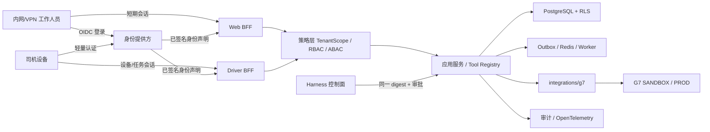

# YXDEMO Threat Model

Version: `1.0`

Observed: `2026-08-24`

Status: `REVIEW_REQUIRED`

## 1. Executive summary

易行物流智能工作台当前只有 Foundation 契约和交付证据，没有生产应用、数据库迁移、真实 G7 调用或部署资源。系统计划仅从本机、公司内网或 VPN 访问，不面向公网匿名用户；这降低了互联网随机扫描风险，但不能降低跨租户越权、员工账号接管、共享司机设备、内部横向移动、管理员误配和供应链替换风险。

最高优先级风险是服务端错误信任客户端提交的租户或角色、身份会话被盗用、司机换人换车后旧会话继续有效，以及未来 Agent 绕过业务授权直接执行写工具。当前代码已经具备不可变 `TenantScope`、结构化错误脱敏、G7 生产与 live 调用失败关闭等契约控制，但这些只是 Foundation 控制，不等于运行时认证、RLS、审计、MFA、设备撤销或审批机制已经实现。

账号体系应使用独立身份提供方承担认证、MFA、会话和账号生命周期，应用服务端继续拥有租户、六角色、组织/标签、班次、代理、任务和 R0-R3 动作授权。Product Gate 与 Design Gate 在这些控制完成审批和验证前必须保持阻断。

## 2. Scope and assumptions

范围包括：

- 当前仓库中的共享契约、G7 防腐层契约、交付门禁和证据。
- 规划中的 Next.js Web/BFF、独立 Driver Companion/Driver BFF、PostgreSQL、Redis Streams/Outbox、G7、地图适配器、Agent Tool Registry、Harness 交付控制面和可观测链路。
- 工作人员、司机、身份管理员、安全审批人、服务账号和紧急账号的认证与授权边界。

已确认假设：

- 用户确认当前只允许本机、公司内网或 VPN 访问。
- 用户确认账号与权限体系由本项目建设，尚未选择最终身份产品。
- Driver Companion 用户不登录内部 Web；司机设备可能共用、替班或处于弱网。
- 当前 Windows 主机只批准开发和测试，不满足生产高可用、独立故障域和灾备要求。
- `ZHLDEMO` 为目标 G7 应用，但旧凭据仍被其他系统使用；本项目不得读取或使用这些凭据。
- 未批准的 `G7-GAP-*` 不授权创建本地表、队列、状态机或服务。

不在本次范围：G7 平台内部实现、公司 VPN 产品内部实现、终端操作系统漏洞和未选定云平台的具体控制。它们作为外部依赖处理，不假定天然可信。

## 3. System model

### Primary components

| Component | Current state | Security responsibility | Evidence |
| --- | --- | --- | --- |
| Web Workbench / BFF | Planned | Workforce session, server-side scope, CSRF, field projection | `_bmad-output/planning-artifacts/architecture/architecture-fleet-office-2026-08-20/architecture.md` |
| Driver Companion / Driver BFF | Planned | Driver/device/task/time-window binding, offline command reconciliation | Same architecture, AD-033 and AD-045 |
| Identity provider | Decision pending | Authentication, MFA, account lifecycle, session revocation | `docs/security/identity-access-decision-brief.md` |
| Application authorization | Contract only | TenantScope, role and data-scope intersection, deny precedence, audit | `packages/contracts/src/tenant-scope.ts` |
| PostgreSQL / RLS | Planned | Local approved truth, transaction tenant context, isolation | Architecture section 2.5 and 9.1 |
| Redis / Outbox / Worker | Planned | Durable event handoff, idempotency, replay bounds | Architecture AD-006..009 |
| G7 anti-corruption layer | Contract only | Only server-side G7 entry, secret isolation, read/write gates | `packages/integrations/g7/src/access-policy.ts` |
| Agent Tool Registry | Planned V1-C | Tool allowlist, R0-R3 approval, readback, no direct G7 access | PRD FR-018..026 and NFR-009 |
| Harness | Scope shells only | Immutable promotion, approvals, secret references and evidence | `docs/delivery/yixing-logistics-workbench-2026-08-24/harness-discovery.md` |

### Data flows and trust boundaries

主要信任边界：终端到身份提供方、终端到 BFF、身份声明到应用作用域、BFF 到数据库、同步消息到 Worker、应用到 G7、Agent 到 Tool Registry、Harness 到运行环境。公司内网和 VPN 是传输入口，不是授权决定来源。

## 4. Assets and security objectives

| Asset | Confidentiality | Integrity | Availability / accountability objective |
| --- | --- | --- | --- |
| 租户、组织和标签范围 | High | Critical | 任意角色切换、代理和工具调用均不得扩大范围 |
| 人员身份、角色、MFA 和会话 | Critical | Critical | 可撤销、可追责、离职和换班及时失效 |
| 车辆、司机、位置、媒体和回单 | Critical | High | 最小披露，来源和新鲜度明确，不把缺失当无风险 |
| 派车、风险处置和司机命令 | High | Critical | 幂等、有版本、写后回读、失败可恢复 |
| G7、地图、模型和数据库凭据 | Critical | Critical | 只在服务端 Secret Manager，永不进入客户端、日志或制品 |
| Agent 计划、证据、审批和工具结果 | High | Critical | 事实/推断分离，R2/R3 未批准执行数为零 |
| 审计、trace、测试和发布证据 | Medium | Critical | 不可静默篡改，可关联操作者、请求、制品 digest 和批准 |
| 发布制品、SBOM 和 provenance | Medium | Critical | 预生产与生产使用同一不可变 digest |

## 5. Attacker model

### Capabilities

- 获得一个普通员工、司机或承包商账号，或控制已登录浏览器和共享司机设备。
- 通过公司内网、VPN 或被攻陷的内网主机调用可达端点并重放请求。
- 修改客户端字段、URL、角色上下文、离线命令、本地缓存和请求顺序。
- 构造恶意订单、消息、媒体元数据、Prompt 或上游响应，诱导越权读取或写入。
- 利用管理员配置错误、过宽角色、过期代理关系、日志泄漏或依赖漏洞扩大权限。
- 对 Feed 制造重复、乱序、游标失效或延迟，尝试污染新鲜度和业务判断。

### Non-capabilities

- 不假定攻击者已控制 G7、Harness、身份提供方或数据库超级管理员。
- 不假定攻击者能突破经过验证的现代密码学。
- 不把物理窃取、内部管理员恶意或供应链攻击排除；它们是低频高影响场景。

## 6. Entry points

| Entry point | Trust change | Main abuse | Evidence anchor |
| --- | --- | --- | --- |
| Workforce login/callback | Unauthenticated to workforce session | 回调篡改、会话固定、弱 MFA | `docs/security/identity-access-decision-brief.md` |
| Web/BFF APIs | Client to server policy | 提交伪造 tenant/role/object ID、批量越权 | PRD FR-002, FR-017, FR-057 |
| Driver login and sync | Shared device to task-scoped session | 替班身份错配、离线重放、附件越权 | PRD FR-063..068, NFR-023..024 |
| G7 adapter | Product to external truth owner | 凭据泄漏、签名重放、写错租户、陈旧事实 | `packages/integrations/g7/src/access-policy.ts` |
| Feed/callback/worker | External or async to internal state | 重复、乱序、伪造来源、毒化投影 | Architecture AD-006..009 |
| Agent Tool Registry | Model output to business action | Prompt 注入、工具越权、绕过审批 | PRD FR-018..026, NFR-009 |
| Imports/exports/media links | Files and links across boundary | 公式注入、恶意文件、敏感导出、长寿命链接 | PRD FR-012, FR-016 |
| Admin consoles | Privileged human to control plane | 自授予、错误映射、删除证据、关闭门禁 | `docs/delivery/yixing-logistics-workbench-2026-08-24/open-decisions.md` |
| Harness deployment | Control plane to runtime | 制品替换、Secret 误绑、审批绕过 | Root `AGENTS.md`, release plan |
| Observability pipeline | Runtime to evidence stores | PII/Secret 泄漏、trace 欺骗、证据删除 | PRD NFR-003, NFR-005 |

## 7. Top abuse paths

1. 普通用户篡改请求中的 `tenant_id` 或对象 ID，BFF 未从可信会话重新派生作用域，导致跨租户查询或写入。
2. 调度员切换到更高权限的界面角色，前端显示限制被当作服务端授权，进而读取敏感字段或执行高风险动作。
3. 离职员工刷新令牌未撤销，或司机换人换车后旧设备会话仍有效，继续提交任务、异常和回单。
4. Agent 读取恶意业务文本后直接调用 G7 或高风险工具，绕过对象范围、R2/R3 审批、幂等和写后回读。
5. 重复或乱序 G7 Feed 被当成最新事实，影响派车、风险关闭或车辆就绪判断；攻击者利用游标恢复制造事实回退。
6. 管理员把角色、组织、标签或代理关系配置为并集，或允许操作人与审批人为同一人，造成静默提权。
7. G7、身份或数据库 Secret 被写入日志、截图、浏览器包或 CI 参数，内网攻击者据此横向访问外部平台。
8. Harness 部署时替换了已验收 digest，或使用不兼容迁移导致生产无法回滚和审计链断裂。

## 8. Threat table

| ID | Threat and impact | Likelihood | Existing controls | Required mitigation and verification | Residual risk |
| --- | --- | --- | --- | --- | --- |
| TM-001 | 客户端租户/角色/对象篡改造成跨租户读写 | High | `createTenantScope` 要求可信租户/用户并冻结范围；架构要求 RLS | OIDC 声明服务端验证；忽略客户端 tenant；deny 优先的作用域求交；事务级 tenant context；负向 API/RLS 测试 TEST-001..003 | 管理员错误映射仍需定期授权复核 |
| TM-002 | 密码、MFA 或会话被盗导致账号接管 | High | 规划短期 access 和可撤销 refresh | 独立 IdP、PKCE、MFA、轮换 refresh、再认证、撤销事件、暴力破解限制、会话设备列表和异常告警 | 被控终端在撤销前仍可操作 |
| TM-003 | 身份管理员自授予业务权限或审批人自批 R3 | High | Product/Design Gate 保持阻断 | 身份管理与业务审批职责分离；双人 R3；不可自批；break-glass 单独监控；角色变更前后值审计 | 小团队可能难以满足双人职责分离 |
| TM-004 | G7 或其他 Secret 泄漏、客户端直连或错误使用 PROD | High impact, current likelihood Low | Secret 标识常量；live/PROD 失败关闭；旧凭据禁止使用；错误 cause 不序列化 | Harness Secret 引用、网络出口限制、短期轮换、日志扫描、客户端 bundle 扫描、PROD 人工批准和写动作白名单 | 外部依赖系统仍使用旧共享凭据 |
| TM-005 | 司机共用设备、替班和离线命令重放造成责任错配 | High | 架构要求设备/任务/时间窗绑定和幂等键 | 轻量重新认证；换人换车立即撤销；加密本地队列；命令过期/版本/幂等检查；远程撤销；弱网 E2E | 设备离线时撤销传播存在有界延迟 |
| TM-006 | Prompt 注入或模型输出绕过 Tool Registry 和 R2/R3 | High once V1-C enabled | 规划 Tool Registry、角色 AI 策略、G7 单一入口 | 模型无凭据；工具服务端重新授权；结构化 schema；批准绑定计划 hash/期限/对象；写后回读；黄金案例与越权测试 | 模型可产生误导建议，必须保留人工判断 |
| TM-007 | Feed 重复、乱序、伪造或陈旧事实污染业务状态 | Medium-High | Event envelope 校验时间顺序；架构要求去重/游标/新鲜度 | 来源签名验证；事件 ID 幂等；happened/received 双时间；版本单调性；游标恢复和投影重放测试 | G7 保留期和限流 OQ-006 未确认 |
| TM-008 | 审计/日志泄露敏感数据或证据被删除 | Medium-High | `AppError.toJSON` 不泄漏 cause；审计要求已定义 | 字段级脱敏；仅追加审计；独立保留策略；请求/trace/制品关联；访问审计和完整性校验；Secret/SARIF 扫描 | 保留期与法务要求未批准 |
| TM-009 | 依赖、构建或发布制品被替换 | Medium | Harness 计划要求同一 digest；锁定 pnpm 依赖 | SBOM、provenance、签名、依赖/容器扫描、分支保护、预生产/生产 digest 比对、回滚演练 | 当前无 Service/Pipeline/registry connector |
| TM-010 | 内网/VPN 被攻陷后横向扫描、DoS 或管理面访问 | Medium | 当前数据服务 loopback；生产入口未创建 | TLS、反向代理、网段 ACL、管理入口隔离、速率限制、主机防火墙、补丁、健康/容量告警 | 单机开发/测试共享故障域，不能作为生产控制 |

## 9. Criticality calibration

| Priority | Threats | Gate consequence |
| --- | --- | --- |
| Critical path | TM-001, TM-002, TM-003, TM-005 | Design Gate 不得通过，直到身份、数据范围、RLS、司机会话和职责分离有批准方案与测试合同 |
| V1 integration path | TM-004, TM-007, TM-008, TM-009 | Build/Security/Acceptance Gate 必须分别提供 Secret、合同、审计、SBOM/provenance 和 digest 证据 |
| V1-C path | TM-006 | AI 能力保持关闭，直到 Tool Registry、R0-R3、写后回读和黄金案例通过 |
| Environment path | TM-010 | 当前主机只作开发/测试；没有独立生产基础设施时不得生产上线 |

风险评级依据是可造成跨租户泄露、不可逆外部写入、司机责任错配、审计失真或不可回滚发布的业务影响，而不是仅按入口是否公网判断。

## 10. Focus paths

1. `TM-001 -> AUTH-001 + OQ-008 -> US-001 -> TEST-001..003 -> Design/Build/Acceptance Gate`。先验证可信声明到 TenantScope，再验证应用查询与 PostgreSQL RLS 双层拒绝。
2. `TM-005 -> G7-GAP-008 -> FR-063..068 -> UJ-015 -> mobile/weak-network gate`。覆盖替班、换车、撤销、重复、乱序、过期和恢复后的责任边界。
3. `TM-004 -> ADR-0002 -> rotated SANDBOX secrets -> G7 contract tests -> Security/Acceptance Gate`。旧共享凭据不进入本项目，签名测试只能在协调轮换后开始。
4. `TM-006 -> G7-GAP-004 -> V1-C feature flag -> late-arrival golden case -> Acceptance Gate`。Agent 永不直接调用 G7，也不持有凭据。
5. `TM-009 -> immutable artifact -> SBOM/provenance/signature -> preprod digest -> production approval`。任一 digest 不一致即中止。

## 11. Quality check

- 仓库现状与规划控制已明确区分，没有把契约代码描述成已部署防护。
- 每个高影响风险均关联需求、架构、代码或交付证据路径。
- 仅内网/VPN 被作为暴露假设，而不是身份或授权保证。
- Secret、真实账号、车辆、司机和租户值均未写入文档。
- 未关闭事项仍在 `open-decisions.md`；本模型不构成 Product、Design、Security 或生产批准。
